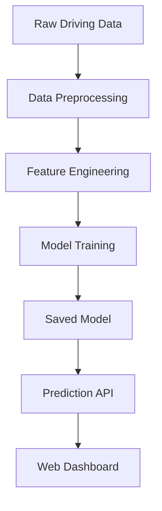

Here’s a **professionally structured and refined** version of your README for the **Battery State of Charge (SoC) Prediction System**:

---

# **Battery State of Charge (SoC) Prediction System**  

  

## **Table of Contents**  
- [Overview](#overview)  
- [System Architecture](#system-architecture)  
- [Data Pipeline](#data-pipeline)  
- [Model Training](#model-training)  
- [Installation](#installation)  
- [Usage](#usage)  
- [API Endpoints](#api-endpoints) 
- [Troubleshooting](#troubleshooting)   

---

## **Overview**  
The **Battery State of Charge (SoC) Prediction System** is a machine learning-based solution designed to predict a battery’s **State of Charge (SoC)** in real-world driving conditions. The system consists of:  

- A **data processing pipeline** that extracts, cleans, and processes driving cycle data.  
- An **XGBoost regression model** trained to predict battery SoC.  
- A **Flask web application** providing an interactive dashboard for real-time predictions.  

---

## **System Architecture**  



---

## **Data Pipeline**  

### **Data Source**  
The system utilizes **real-world driving data** from **Kaggle**, specifically:  
- **Dataset**: *Battery and Heating Data in Real Driving Cycles*  
- **Description**: Includes **32 driving trips** recorded at **1Hz sampling frequency**  
- **Features**: **50+ parameters** including velocity, throttle, battery voltage, and temperature  

### **Preprocessing Steps**  
1. **Data Consolidation**  
   - Ensures consistent feature representation across all trips  
   - Example:  
     ```python
     def conform_datasets(nbOfTrips, pathToFiles, col_list=None):
         # Standardizes features across datasets
     ```
  
2. **Feature Engineering**  
   - Creates **windowed** features (e.g., **60-second intervals**)  
   - Computes **average values** for relevant parameters  
   - Example:  
     ```python
     def prepare_features(df_TripList, stepWidth=60, dropNan=False):
         # Extracts rolling average and feature windows
     ```
  
3. **Feature Selection**  
   - Removes non-predictive variables  
   - Example:  
     ```python
     consistent_cols.remove("min. SoC [%]")
     consistent_cols.remove("max. SoC [%]")
     ```

---

## **Model Training**  

### **Algorithm**: XGBoost Regressor  
- The model is trained using **XGBoost**, optimized for regression tasks.  
- Example model configuration:  
  ```python
  model = XGBRegressor(
      n_estimators=50,
      max_depth=5,
      eta=0.1,
      subsample=0.7,
      colsample_bytree=0.8
  )
  ```

### **Training Process**  
1. Splitting data into **80% training** and **20% testing**  
2. Applying **StandardScaler** for feature normalization  
3. Training the **XGBoost model** with **early stopping**  

### **Saved Artifacts**  
- `model.json` → Trained XGBoost model  
- `scaler.save` → Preprocessing scaler for feature transformation  
- `processed_dataset.csv` → Preprocessed dataset used for training  

---

## **Installation**  

### **Prerequisites**  
- **Python 3.8+**  
- Kaggle API key for dataset download  
- GPU (optional but recommended for model training)  

### **Setup**  

1. **Install dependencies**  
   ```bash
   pip install -r requirements.txt
   ```

2. **Configure Kaggle API**  
   ```bash
   mkdir ~/.kaggle
   cp kaggle.json ~/.kaggle/
   chmod 600 ~/.kaggle/kaggle.json
   ```

3. **Download dataset**  
   ```python
   import kagglehub
   dataset_path = kagglehub.dataset_download(
       'atechnohazard/battery-and-heating-data-in-real-driving-cycles'
   )
   ```

---

## **Usage**  

### **Training Mode**  
To train the model:  
```bash
python model.py --train --epochs 100
```

### **Run Flask Web Application**  
To start the **prediction dashboard**:  
```bash
python app.py
```
Once running, open:  
```
http://localhost:5000
```

---

## **API Endpoints**  

| Endpoint      | Method | Description                          |
|--------------|--------|--------------------------------------|
| `/`          | GET    | Serves the main prediction dashboard |
| `/predict`   | POST   | JSON API for making SoC predictions |


### **Project Directory Structure**  

```
project/
├── data/                   # Raw trip data
├── models/                 # Trained models & scalers
│   ├── model.json
│   └── scaler.save
├── static/                 # Web assets (CSS, JS, images)
├── templates/              # HTML templates for the dashboard
├── app.py                  # Flask web application
├── model.py                # ML training script
├── processed_dataset.csv    # Preprocessed input data
└── requirements.txt        # Required dependencies
```

---

## **Troubleshooting**  

### **Common Issues & Fixes**  

1. **Missing Data Files**  
   - Ensure the dataset has been downloaded  
   - Verify file paths in `conform_datasets()`

2. **Feature Mismatch Errors**  
   - Make sure the model expects **correct input features**  
   - Cross-check `expected_features` in `app.py`

3. **Memory Errors While Training**  
   - Reduce the **stepWidth** in `prepare_features()`  
   - Use **smaller batch sizes** for training  

---

### **📌 Screenshot: Prediction Dashboard**


🚀 *Ready to predict battery SoC dynamically with an interactive dashboard!*